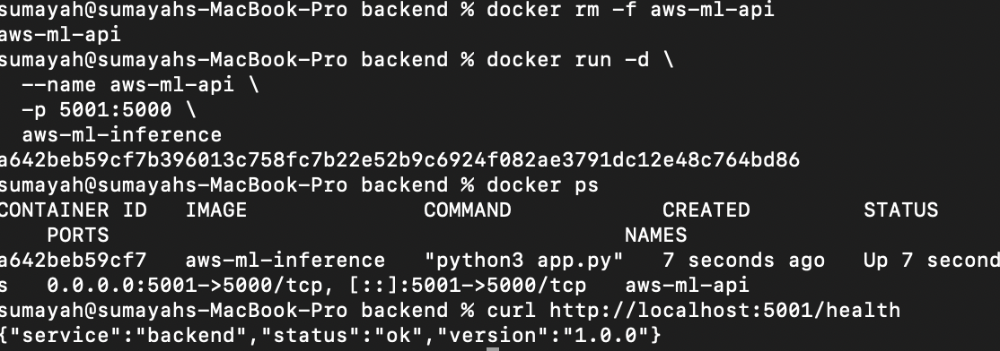
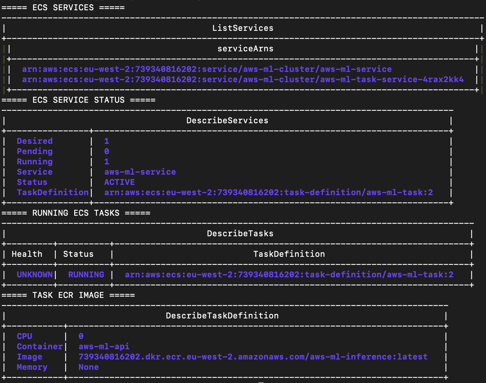
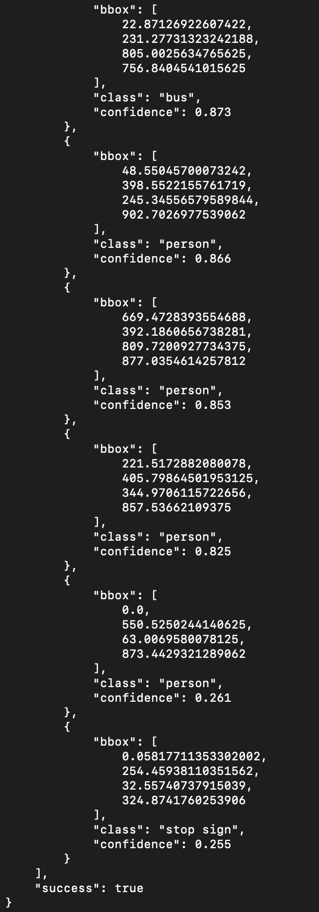
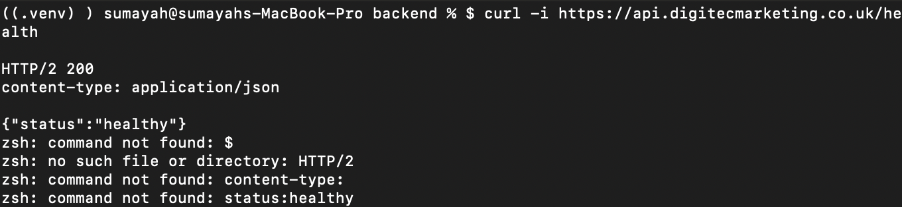
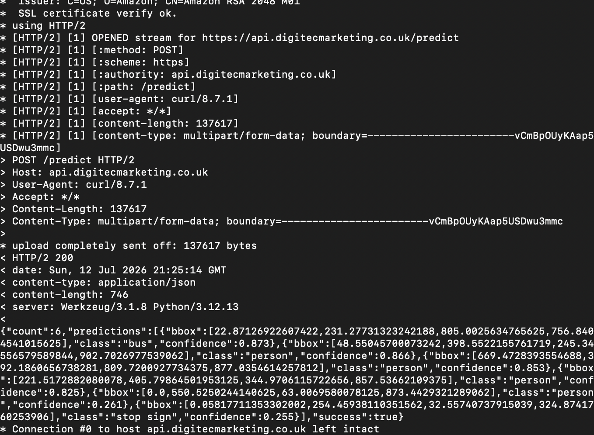

# AWS Ml Inference Platform

# YOLOv8 Object Detection Platform on AWS ECS

A production-style MLOps project demonstrating the deployment of an AI-powered object detection application using Docker, Amazon ECS (Fargate), Terraform, GitHub Actions, and AWS networking services.

This project follows modern DevOps and MLOps practices by containerising a machine learning application, deploying it onto AWS using Infrastructure as Code (IaC), and automating deployments through CI/CD pipelines.

---

## Project Objectives

- Deploy a YOLOv8 object detection model as a scalable web application.
- Build a frontend for uploading images and displaying inference results.
- Serve predictions through a Flask REST API.
- Containerise the application using Docker.
- Store container images in Amazon ECR.
- Deploy containers to Amazon ECS using Fargate.
- Provision all AWS infrastructure using Terraform.
- Secure the application with HTTPS using AWS Certificate Manager (ACM).
- Configure a custom domain using Amazon Route 53.
- Automate deployments with GitHub Actions using OpenID Connect (OIDC).

---

# Architecture

```text
                    Internet
                        │
                        ▼
               Route53 DNS Record
                        │
                        ▼
             AWS Certificate Manager
                        │
                        ▼
         Application Load Balancer (HTTPS)
                        │
        ┌───────────────┴───────────────┐
        │                               │
        ▼                               ▼
 React Frontend ECS Service      Flask Backend ECS Service
                                        │
                                        ▼
                                  YOLOv8 Model
                                        │
                                        ▼
                                Object Detection
```

---

## Technology Stack

### Machine Learning

- YOLOv8 Nano
- Python
- Flask
- OpenCV
- Ultralytics

### Frontend

- React
- Vite
- JavaScript
- HTML5
- CSS

### Containers

- Docker
- Multi-stage Docker Builds
- Non-root Containers

### AWS

- Amazon ECS (Fargate)
- Amazon ECR
- Application Load Balancer (ALB)
- Amazon Route 53
- AWS Certificate Manager (ACM)
- IAM
- CloudWatch Logs
- AWS Systems Manager Parameter Store

### Infrastructure as Code

- Terraform
- Remote State (S3)
- DynamoDB State Locking

### CI/CD

- GitHub Actions
- GitHub OIDC Authentication
- Docker Buildx

---

# Repository Structure

```text
ecs-yolov8-mlops/
│
├── app/
│   ├── backend/
│   ├── frontend/
│   └── .dockerignore
│
├── infra/
│   ├── modules/
│   ├── provider.tf
│   ├── backend.tf
│   ├── variables.tf
│   ├── outputs.tf
│   └── terraform.tfvars.example
│
├── .github/
│   └── workflows/
│
├── docs/
│
├── README.md
└── .gitignore
```

---

# Features

- Image upload for object detection
- YOLOv8 inference API
- Interactive React frontend
- REST API using Flask
- Dockerised application
- Production-ready container images
- HTTPS support
- Custom domain
- Infrastructure as Code
- Automated deployments
- CloudWatch logging
- Environment variable configuration

---

# REST API

## Health Check

### Request

```http
GET /health
```

### Response

```json
{
  "status": "ok"
}
```

---

## Object Detection

### Request

```http
POST /predict
```

Accepts a multipart image upload.

### Response

```json
{
  "detections": [
    {
      "class": "person",
      "confidence": 0.98,
      "box": [
        124,
        82,
        402,
        611
      ]
    }
  ]
}
```

---

# Local Development

## Clone Repository

```bash
git clone https://github.com/<username>/ecs-yolov8-mlops.git

cd ecs-yolov8-mlops
```

---

## Backend

```bash
cd app/backend

python -m venv .venv

source .venv/bin/activate

pip install -r requirements.txt

python app.py
```

Backend will be available at:

```text
http://localhost:5000
```


## Backend Verification

Verify that the backend is running correctly before continuing.

### Health Check

```bash
curl http://localhost:5000/health
```

Expected response:

```json
{
  "service": "backend",
  "status": "ok",
  "version": "1.0.0"
}
```

# Project Progress

The AWS ML Inference Platform was developed using an incremental sprint-based approach. Each sprint introduces a production-focused feature, with screenshots captured after successful implementation and verification. This development process demonstrates not only the final solution but also the engineering workflow, validation, and progression from a simple Flask application to a fully containerized, cloud-ready machine learning inference platform.

The screenshots below document each completed milestone throughout the project.

# Sprint 1 – Flask Backend Setup

## Objective

Create the foundation of the AWS ML Inference Platform by building a Flask REST API project with a clean backend structure.

## Technologies

- Python 3.12
- Flask
- Virtual Environment (venv)
- Git
- GitHub

## Achievements

- Created the project repository
- Configured a Python virtual environment
- Installed Flask and project dependencies
- Created the backend application structure
- Implemented the Flask application entry point
- Configured Git version control
- Published the initial project to GitHub

## Verification

Start the Flask application:

```bash
python3 app.py
```

Verify the API is running:

```bash
curl http://localhost:5000/
```

Response

```json
{
  "application": "AWS ML Inference Platform",
  "status": "running"
}
```

## Screenshot

**Filename**

```text
docs/screenshots/01-flask-backend-setup.png
```


# Sprint 2 – Health Check Endpoint

## Objective

Implement a dedicated health endpoint to monitor application availability and verify backend status.

## Technologies

- Flask
- REST API
- JSON

## Achievements

- Created the `/health` endpoint
- Returned structured JSON responses
- Added application version information
- Verified endpoint accessibility using curl
- Prepared the backend for containerization and deployment

## Verification

```bash
curl http://localhost:5000/health
```

Response

```json
{
  "service": "backend",
  "status": "ok",
  "version": "1.0.0"
}
```

## Screenshot

**Filename**

```text
docs/screenshots/02-backend-health-endpoint.png
```


# Sprint 3 – YOLOv8 Object Detection API

## Objective

Integrate the YOLOv8 pretrained model into the Flask backend to provide real-time object detection through a REST API.

## Technologies

- Python 3.12
- Flask
- Ultralytics YOLOv8
- OpenCV
- REST API

## Achievements

- Downloaded and configured the YOLOv8 pretrained model
- Implemented an object detection service
- Added the `/predict` API endpoint
- Processed uploaded images using YOLOv8
- Returned predictions as JSON
- Verified successful inference using the sample bus image

## Verification

```bash
curl -X POST \
-F "image=@bus.jpg" \
http://localhost:5000/predict
```

## Screenshot

**Filename**

```text
docs/screenshots/03-yolov8-object-detection-api.png
```


# Sprint 4 – Docker Containerization

## Objective

Containerize the Flask and YOLOv8 application using Docker to create a portable and production-ready deployment.

## Technologies

- Docker
- Python 3.12
- Flask
- YOLOv8
- Docker CLI

## Achievements

- Created a Dockerfile for the application
- Built the Docker image successfully
- Installed required Linux dependencies for OpenCV
- Started the application inside a Docker container
- Exposed the API on port 5001
- Verified the container using the health endpoint

## Verification

```bash
docker build -t aws-ml-inference .
```

```bash
docker run -d \
--name aws-ml-api \
-p 5001:5000 \
aws-ml-inference
```

```bash
curl http://localhost:5001/health
```

## Screenshot

**Filename**

```text
docs/screenshots/04-docker-container-running.png
```



# Sprint 5 – Amazon Elastic Container Registry (ECR)

...

## Screenshot

**Filename**

```text
docs/screenshots/05-amazon-ecr.png
```


# Sprint 6 – Amazon ECS Deployment

...

## Screenshot

**Filename**

```text
docs/screenshots/06-ecs-deployment.png
```



# Sprint 7 – Terraform Infrastructure as Code

...

## Screenshot

**Filename**

```text
docs/screenshots/07-terraform-infrastructure.png
```



# Sprint 8 – GitHub Actions CI/CD

...

## Screenshot

**Filename**

```text
docs/screenshots/08-github-actions-pipeline.png
```


# Sprint 9 – HTTPS and Custom Domain

...

## Screenshot

**Filename**

```text
docs/screenshots/09-https-custom-domain.png
```



# Sprint 10 – Final Production Deployment

...

## Screenshot

**Filename**

```text
docs/screenshots/10-production-deployment.png
```




---

## Frontend

```bash
cd app/frontend

npm install

npm run dev
```

Frontend will be available at:

```text
http://localhost:5173
```

---

# Docker

## Backend

```bash
docker build -t yolov8-backend .

docker run -p 5000:5000 yolov8-backend
```

---

## Frontend

```bash
docker build -t yolov8-frontend .

docker run -p 3000:3000 yolov8-frontend
```

---

# Infrastructure

Terraform provisions:

- VPC
- Public Subnets
- Internet Gateway
- Security Groups
- ECS Cluster
- ECS Services
- ECS Task Definitions
- Amazon ECR
- Application Load Balancer
- ACM Certificate
- Route 53 DNS Record
- IAM Roles
- CloudWatch Log Groups

---

# Deployment Pipeline

```text
Developer Push

        │

        ▼

GitHub Actions

        │

        ▼

Docker Build

        │

        ▼

Push Images to Amazon ECR

        │

        ▼

Terraform Apply

        │

        ▼

Update ECS Service

        │

        ▼

Health Check

        │

        ▼

Deployment Complete
```

---

# CI/CD

The GitHub Actions workflows perform the following tasks:

1. Build Docker images
2. Tag images using the Git commit SHA
3. Push images to Amazon ECR
4. Validate Terraform configuration
5. Generate a Terraform execution plan
6. Deploy infrastructure
7. Update ECS task definitions
8. Deploy the latest application version
9. Execute post-deployment health checks

---

# Security

This project follows several production security best practices:

- HTTPS enforced using ACM
- IAM least privilege access
- GitHub OIDC authentication (no long-lived AWS credentials)
- Secrets stored in AWS Systems Manager Parameter Store
- Non-root Docker containers
- Private Amazon ECR repositories

---

# Cost Estimate

| AWS Service | Estimated Monthly Cost |
|-------------|----------------------:|
| ECS Fargate | ~$15–25 |
| Application Load Balancer | ~$18 |
| Route 53 Hosted Zone | ~$0.50 |
| ACM Certificate | Free |
| CloudWatch Logs | <$2 |
| Amazon ECR | <$1 |
| S3 Backend | <$1 |
| DynamoDB Lock Table | <$1 |

**Estimated Total:** **~$35–50/month**

> **Note:** Destroy infrastructure after use to minimise AWS costs.

---

# Cleanup

Destroy all infrastructure:

```bash
terraform destroy
```

Remove unused Docker images:

```bash
docker image prune
```

---

# Future Improvements

- Webcam object detection
- Amazon S3 image storage
- Auto Scaling
- Blue/Green deployments
- Redis inference cache
- Asynchronous inference using Amazon SQS
- ML model versioning
- Model registry integration
- Prometheus metrics
- Grafana dashboards
- Kubernetes (EKS) deployment
- GitOps with Argo CD

---

# Screenshots

The following screenshots will be added during development:

- Frontend UI
- Successful object detection results
- Amazon ECS Cluster
- ECS Services
- Application Load Balancer
- Route 53 DNS configuration
- HTTPS certificate
- CloudWatch Logs
- Successful GitHub Actions workflow
- Terraform deployment

---

# Learning Outcomes

By completing this project you will gain hands-on experience with:

- Machine Learning deployment
- Containerisation with Docker
- AWS networking
- Amazon ECS (Fargate)
- Infrastructure as Code (Terraform)
- Terraform modules
- CI/CD pipelines
- Cloud security best practices
- Production application deployment
- Modern MLOps workflows

---

# License

This project is provided for educational and portfolio purposes.