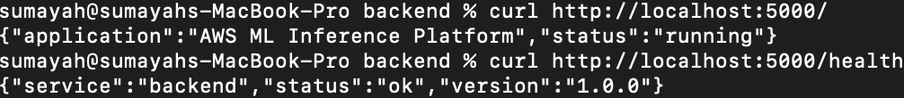
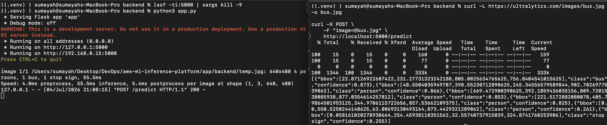
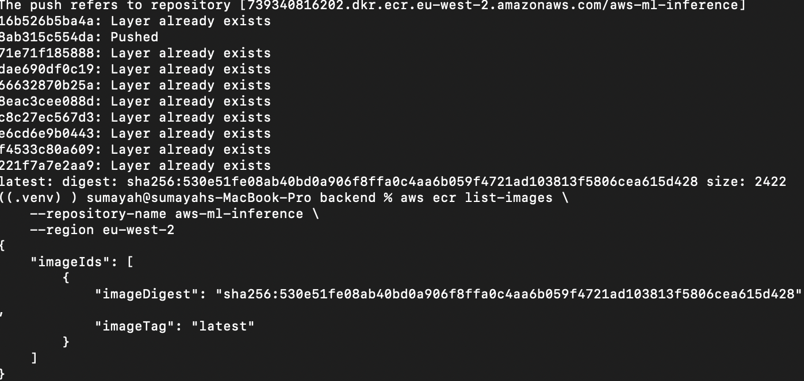
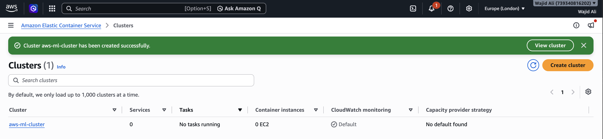
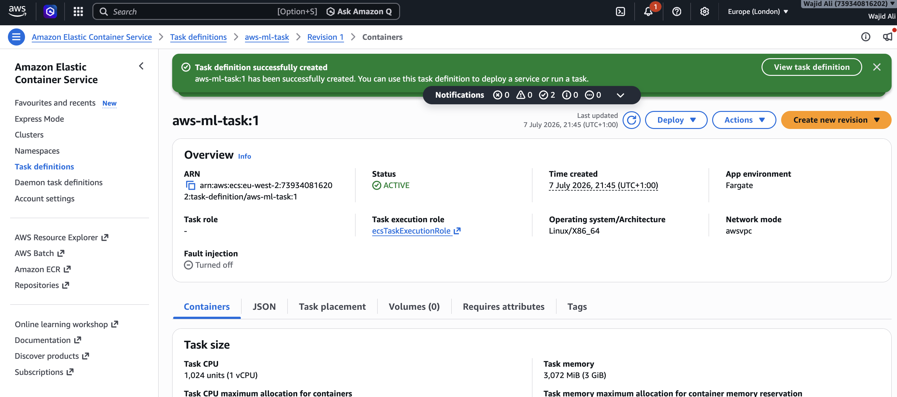
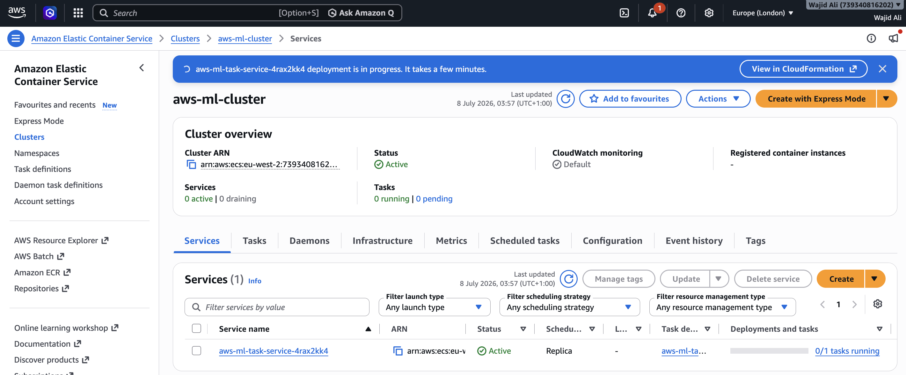
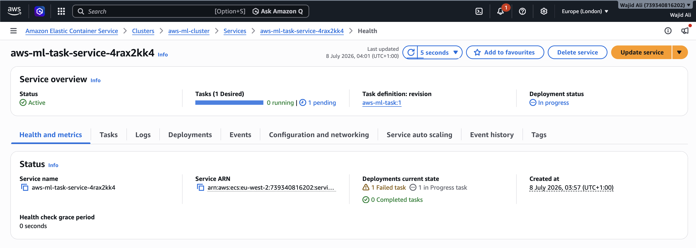
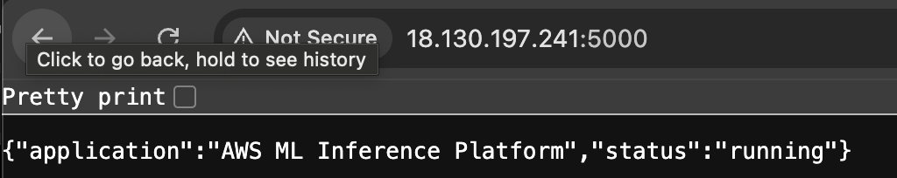

# AWS Ml Inference Platform

# YOLOv8 Object Detection Platform on AWS ECS

A production-style MLOps project demonstrating the deployment of an AI-powered object detection application using Docker, Amazon ECS (Fargate), Terraform, GitHub Actions, and AWS networking services.

This project follows modern DevOps and MLOps practices by containerising a machine learning application, deploying it onto AWS using Infrastructure as Code (IaC), and automating deployments through CI/CD pipelines.

---

## Project Objectives

- Deploy a YOLOv8 object detection model as a scalable web application.
- Build a frontend for uploading images and displaying inference results.
- Serve predictions through a Flask REST API.
- Containerise the application using Docker.
- Store container images in Amazon ECR.
- Deploy containers to Amazon ECS using Fargate.
- Provision all AWS infrastructure using Terraform.
- Secure the application with HTTPS using AWS Certificate Manager (ACM).
- Configure a custom domain using Amazon Route 53.
- Automate deployments with GitHub Actions using OpenID Connect (OIDC).

---

# Architecture

```text
                    Internet
                        │
                        ▼
               Route53 DNS Record
                        │
                        ▼
             AWS Certificate Manager
                        │
                        ▼
         Application Load Balancer (HTTPS)
                        │
        ┌───────────────┴───────────────┐
        │                               │
        ▼                               ▼
 React Frontend ECS Service      Flask Backend ECS Service
                                        │
                                        ▼
                                  YOLOv8 Model
                                        │
                                        ▼
                                Object Detection
```

---

## Technology Stack

### Machine Learning

- YOLOv8 Nano
- Python
- Flask
- OpenCV
- Ultralytics

### Frontend

- React
- Vite
- JavaScript
- HTML5
- CSS

### Containers

- Docker
- Multi-stage Docker Builds
- Non-root Containers

### AWS

- Amazon ECS (Fargate)
- Amazon ECR
- Application Load Balancer (ALB)
- Amazon Route 53
- AWS Certificate Manager (ACM)
- IAM
- CloudWatch Logs
- AWS Systems Manager Parameter Store

### Infrastructure as Code

- Terraform
- Remote State (S3)
- DynamoDB State Locking

### CI/CD

- GitHub Actions
- GitHub OIDC Authentication
- Docker Buildx

---

# Repository Structure

```text
ecs-yolov8-mlops/
│
├── app/
│   ├── backend/
│   ├── frontend/
│   └── .dockerignore
│
├── infra/
│   ├── modules/
│   ├── provider.tf
│   ├── backend.tf
│   ├── variables.tf
│   ├── outputs.tf
│   └── terraform.tfvars.example
│
├── .github/
│   └── workflows/
│
├── docs/
│
├── README.md
└── .gitignore
```

---

# Features

- Image upload for object detection
- YOLOv8 inference API
- Interactive React frontend
- REST API using Flask
- Dockerised application
- Production-ready container images
- HTTPS support
- Custom domain
- Infrastructure as Code
- Automated deployments
- CloudWatch logging
- Environment variable configuration

---

# REST API

## Health Check

### Request

```http
GET /health
```

### Response

```json
{
  "status": "ok"
}
```

---

## Object Detection

### Request

```http
POST /predict
```

Accepts a multipart image upload.

### Response

```json
{
  "detections": [
    {
      "class": "person",
      "confidence": 0.98,
      "box": [
        124,
        82,
        402,
        611
      ]
    }
  ]
}
```

---

# Local Development

## Clone Repository

```bash
git clone https://github.com/<username>/ecs-yolov8-mlops.git

cd ecs-yolov8-mlops
```

---

## Backend

```bash
cd app/backend

python -m venv .venv

source .venv/bin/activate

pip install -r requirements.txt

python app.py
```

Backend will be available at:

```text
http://localhost:5000
```


## Backend Verification

Verify that the backend is running correctly before continuing.

### Health Check

```bash
curl http://localhost:5000/health
```

Expected response:

```json
{
  "service": "backend",
  "status": "ok",
  "version": "1.0.0"
}
```

# Project Progress

The AWS ML Inference Platform was developed using an incremental sprint-based approach. Each sprint introduces a production-focused feature, with screenshots captured after successful implementation and verification. This development process demonstrates not only the final solution but also the engineering workflow, validation, and progression from a simple Flask application to a fully containerized, cloud-ready machine learning inference platform.

The screenshots below document each completed milestone throughout the project.

## Sprint 1 – Backend API Foundation

The initial Flask backend was created to provide the foundation for the machine learning inference platform. REST endpoints were implemented for application status and health monitoring, allowing the service to be validated locally before integrating the machine learning components in later sprints.



## Sprint 2 – YOLOv8 Model Integration

The pretrained YOLOv8 model was integrated into the backend application by adding the model file to the project and configuring the Python environment with the required Ultralytics dependencies. The installation was verified by confirming the model was available within the application and could be successfully imported before implementing the object detection API.


## Sprint 3 – Object Detection API

The Flask backend was extended with a REST API endpoint that accepts uploaded images and performs real-time object detection using the integrated YOLOv8 model. The implementation was validated by submitting a test image to the `/predict` endpoint and verifying that the service successfully returned detected object classes, confidence scores and bounding box coordinates in JSON format while logging the inference process on the server.



## Sprint 4 – Docker Containerization

The backend application was successfully containerized using Docker to provide a consistent and portable runtime environment. After building the Docker image, the container was launched with port mapping enabled and verified using Docker CLI commands. The `/health` endpoint was then accessed through the running container to confirm the application was operating correctly inside the Docker environment.


## Sprint 5 – Amazon ECR Integration

**Objective:** Configure AWS CLI, create an Amazon Elastic Container Registry (ECR) repository, authenticate Docker with AWS, and publish the application container image.

### Progress Summary

During this sprint the project was integrated with AWS for container image management. The AWS CLI was configured and authenticated using IAM credentials, an Amazon ECR repository was created, Docker was authenticated against the registry, and the application image was successfully pushed to ECR.

This completed the transition from a locally built Docker image to a cloud-hosted container image ready for deployment into Amazon ECS.

### Screenshot

**File:** `05-ecr-image-pushed.png`



# Sprint 6 – Amazon ECS Deployment

**Objective:** Deploy the containerised machine learning inference application to Amazon Elastic Container Service (ECS) using AWS Fargate. This sprint transitions the application from a locally tested Docker container to a fully managed cloud-hosted container running within AWS.

---

## Progress Summary

During this sprint, an Amazon ECS cluster was created using the AWS Fargate serverless compute engine. An ECS Task Definition was then configured to use the Docker image previously stored in Amazon Elastic Container Registry (ECR). Finally, an ECS Service was deployed to launch and manage the running container, providing a scalable and highly available runtime environment for the inference API.

---

## Step 1 – Create the Amazon ECS Cluster

An Amazon ECS cluster was created to provide the infrastructure required to host containerised workloads using AWS Fargate.

**Screenshot**

**File:** `06-ecs-cluster-created.png`



---

## Step 2 – Create the ECS Task Definition

An ECS Task Definition was created to define how the application container should run. This included the Amazon ECR image, CPU and memory allocation, networking mode, and the application port exposed by the container.

**Screenshot**

**File:** `06-task-definition-created.png`



---

## Step 3 – Deploy the ECS Service

An ECS Service was created using the Task Definition to deploy the application onto AWS Fargate. The service ensures that the required number of application containers remain running and automatically replaces failed tasks.

**Screenshot**

**File:** `06-ecs-service-created.png`



---

## Step 4 – Verify Running ECS Task

The deployed ECS task was verified within the cluster to confirm that the application container was successfully running under AWS Fargate.

**Screenshot**

**File:** `06-running-task.png`



---

## Step 5 – Verify Application Endpoint

The deployed inference API was tested through its ECS endpoint to confirm that the application was successfully deployed and accessible from AWS infrastructure.

**Screenshot**

**File:** `06-ecs-api-working.png`



# Sprint 7 – Terraform Infrastructure as Code

...

## Screenshot

**Filename**

```text
docs/screenshots/07-terraform-infrastructure.png
```


# Sprint 8 – GitHub Actions CI/CD

...

## Screenshot

**Filename**

```text
docs/screenshots/08-github-actions-pipeline.png
```


# Sprint 9 – HTTPS and Custom Domain

...

## Screenshot

**Filename**

```text
docs/screenshots/09-https-custom-domain.png
```


# Sprint 10 – Final Production Deployment

...

## Screenshot

**Filename**

```text
docs/screenshots/10-production-deployment.png
```


---

## Frontend

```bash
cd app/frontend

npm install

npm run dev
```

Frontend will be available at:

```text
http://localhost:5173
```

---

# Docker

## Backend

```bash
docker build -t yolov8-backend .

docker run -p 5000:5000 yolov8-backend
```

---

## Frontend

```bash
docker build -t yolov8-frontend .

docker run -p 3000:3000 yolov8-frontend
```

---

# Infrastructure

Terraform provisions:

- VPC
- Public Subnets
- Internet Gateway
- Security Groups
- ECS Cluster
- ECS Services
- ECS Task Definitions
- Amazon ECR
- Application Load Balancer
- ACM Certificate
- Route 53 DNS Record
- IAM Roles
- CloudWatch Log Groups

---

# Deployment Pipeline

```text
Developer Push

        │

        ▼

GitHub Actions

        │

        ▼

Docker Build

        │

        ▼

Push Images to Amazon ECR

        │

        ▼

Terraform Apply

        │

        ▼

Update ECS Service

        │

        ▼

Health Check

        │

        ▼

Deployment Complete
```

---

# CI/CD

The GitHub Actions workflows perform the following tasks:

1. Build Docker images
2. Tag images using the Git commit SHA
3. Push images to Amazon ECR
4. Validate Terraform configuration
5. Generate a Terraform execution plan
6. Deploy infrastructure
7. Update ECS task definitions
8. Deploy the latest application version
9. Execute post-deployment health checks

---

# Security

This project follows several production security best practices:

- HTTPS enforced using ACM
- IAM least privilege access
- GitHub OIDC authentication (no long-lived AWS credentials)
- Secrets stored in AWS Systems Manager Parameter Store
- Non-root Docker containers
- Private Amazon ECR repositories

---

# Cost Estimate

| AWS Service | Estimated Monthly Cost |
|-------------|----------------------:|
| ECS Fargate | ~$15–25 |
| Application Load Balancer | ~$18 |
| Route 53 Hosted Zone | ~$0.50 |
| ACM Certificate | Free |
| CloudWatch Logs | <$2 |
| Amazon ECR | <$1 |
| S3 Backend | <$1 |
| DynamoDB Lock Table | <$1 |

**Estimated Total:** **~$35–50/month**

> **Note:** Destroy infrastructure after use to minimise AWS costs.

---

# Cleanup

Destroy all infrastructure:

```bash
terraform destroy
```

Remove unused Docker images:

```bash
docker image prune
```

---

# Future Improvements

- Webcam object detection
- Amazon S3 image storage
- Auto Scaling
- Blue/Green deployments
- Redis inference cache
- Asynchronous inference using Amazon SQS
- ML model versioning
- Model registry integration
- Prometheus metrics
- Grafana dashboards
- Kubernetes (EKS) deployment
- GitOps with Argo CD

---

# Screenshots

The following screenshots will be added during development:

- Frontend UI
- Successful object detection results
- Amazon ECS Cluster
- ECS Services
- Application Load Balancer
- Route 53 DNS configuration
- HTTPS certificate
- CloudWatch Logs
- Successful GitHub Actions workflow
- Terraform deployment

---

# Learning Outcomes

By completing this project you will gain hands-on experience with:

- Machine Learning deployment
- Containerisation with Docker
- AWS networking
- Amazon ECS (Fargate)
- Infrastructure as Code (Terraform)
- Terraform modules
- CI/CD pipelines
- Cloud security best practices
- Production application deployment
- Modern MLOps workflows

---

# License

This project is provided for educational and portfolio purposes.